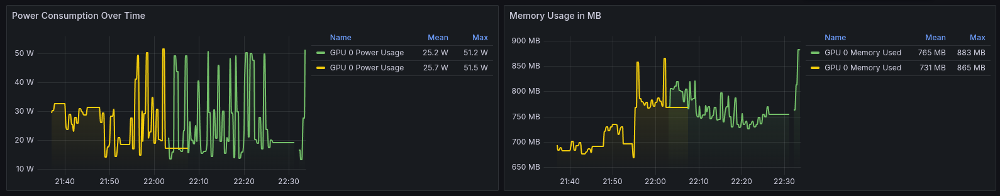

# GPU Monitoring with Grafana, Prometheus, and DCGM Exporter

Monitor GPUs with Grafana, Prometheus, and DCGM Exporter. Track temperature, power, memory, and utilization in real-time.

## Dashboard Features

The monitoring solution provides several key visualizations:

- **GPU Temperature**: Real-time temperature monitoring with historical trends
- **Power Consumption**: Track power usage in watts with peaks and averages
- **Memory Usage**: Monitor GPU memory allocation in MB
- **GPU Utilization**: Track percentage utilization over time
- **Memory Copy Utilization**: Monitor memory bandwidth usage

## Prerequisites

Before you begin, ensure you have the following prerequisites installed:

#### Docker

Docker is required to run containerized applications. To install Docker:

- **Linux**: Follow the [official Docker installation guide](https://docs.docker.com/engine/install/) for your specific distribution.

#### NVIDIA Container Toolkit

The NVIDIA Container Toolkit is required to run GPU-accelerated containers. To install it, follow these steps:

For more detailed installation instructions, refer to the [official NVIDIA Container Toolkit documentation](https://docs.nvidia.com/datacenter/cloud-native/container-toolkit/latest/install-guide.html).

## Components
The monitoring stack consists of the following components:

- **DCGM Exporter**: NVIDIA's Data Center GPU Manager exporter that collects GPU metrics
- **Prometheus**: Time-series database that stores the collected metrics
- **Grafana**: Visualization platform used to create dashboards and alerts
- **Node Exporter**: Collects system-level metrics including CPU, memory, disk, and network statistics

## Configuration

The default configuration should work for most setups. To customize:

- Prometheus settings: Edit `prometheus/prometheus.yml`
- Grafana dashboards: Pre-configured dashboards are available at `config/grafana/dashboards` or you can create your own

## Acknowledgements

This project is based on [gpu-monitoring-docker-compose](https://github.com/hongshibao/gpu-monitoring-docker-compose) by hongshibao.
